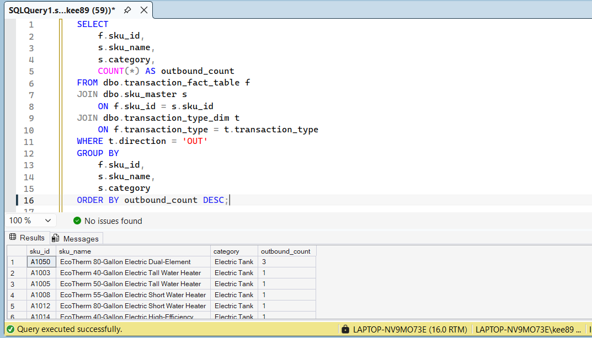
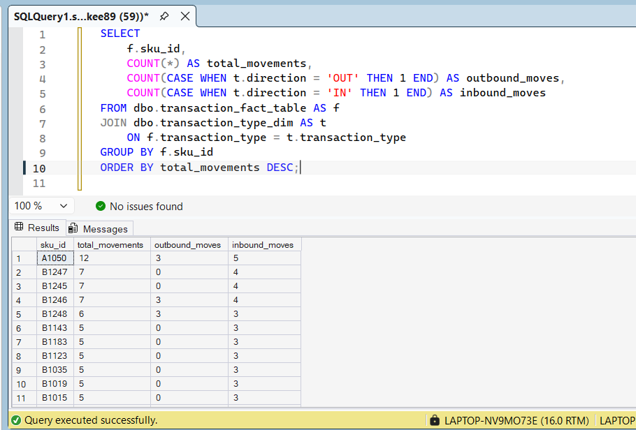
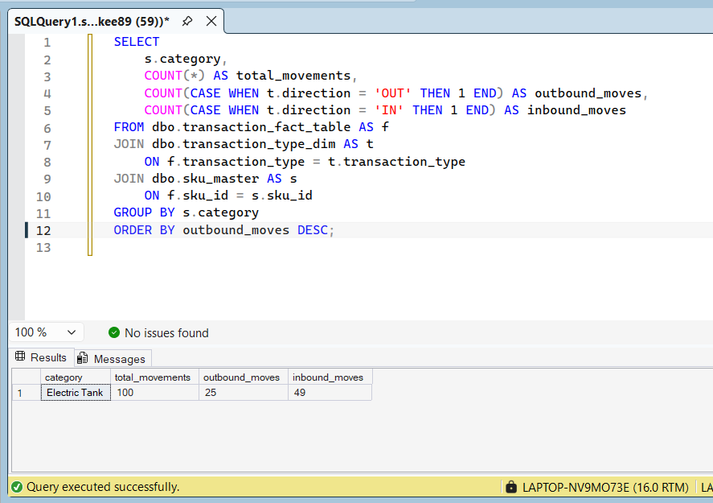

## 🔍 Overview

This project showcases SQL queries used to explore and analyze warehouse datasets, including product movement, handler performance, and inventory flow. The SQL work demonstrates the ability to:

- Clean and structure raw data  
- Join multiple tables  
- Build CTE‑driven logic  
- Use window functions for ranking and time‑based analysis  
- Extract insights that support supply chain and operations decision‑making  

The visuals included in this repository summarize key findings and show how SQL outputs translate into business‑ready insights.

---

## 🧠 Skills Demonstrated

- Joins (INNER, LEFT, FULL)  
- Common Table Expressions (CTEs)  
- Window Functions (ROW_NUMBER, RANK, LAG, LEAD)  
- Aggregations & Grouping  
- Data Cleaning & Filtering  
- Business Logic Development  
- Operational KPI Interpretation  

## 🖼️ Screenshot 1 — Outbound SKU Velocity Report

**Summary:**  
This screenshot represents the outbound SKU velocity analysis. It highlights which products are moving fastest through the warehouse, helping identify high‑velocity SKUs that require priority slotting, faster replenishment, or dedicated handling strategies. This visual translates raw SQL output into operational insight that supports inventory planning and warehouse flow optimization.

## 🖼️ Screenshot 2 — SKU Movement Velocity

**Summary:**  
This screenshot represents the SKU movement velocity analysis. It highlights how frequently each SKU moves through the warehouse, allowing you to identify fast‑moving, slow‑moving, and stagnant products. This insight supports decisions around slotting, replenishment cycles, storage optimization, and overall warehouse flow efficiency.

## 🖼️ Screenshot 3 — Category Movement Flow

**Summary:**  
This screenshot shows the category‑level movement flow analysis. It identifies which product categories move the most through the warehouse and breaks their activity into inbound and outbound movement. This helps reveal which categories drive the highest operational load, where warehouse strain is concentrated, and how category‑level demand patterns shape storage, replenishment, and labor planning.

