## 🔍 Overview

This project showcases SQL queries used to explore and analyze warehouse datasets, including product movement, handler performance, and inventory flow. The SQL work demonstrates the ability to:

- Clean and structure raw data  
- Join multiple tables  
- Build CTE‑driven logic  
- Use window functions for ranking and time‑based analysis  
- Extract insights that support supply chain and operations decision‑making  

The visuals included in this repository summarize key findings and show how SQL outputs translate into business‑ready insights.

---

## 🧠 Skills Demonstrated

- Joins (INNER, LEFT, FULL)  
- Common Table Expressions (CTEs)  
- Window Functions (ROW_NUMBER, RANK, LAG, LEAD)  
- Aggregations & Grouping  
- Data Cleaning & Filtering  
- Business Logic Development  
- Operational KPI Interpretation  

## 🖼️ Screenshot 1 — Outbound SKU Velocity Report

**Summary:**  
This screenshot represents the outbound SKU velocity analysis. It highlights which products are moving fastest through the warehouse, helping identify high‑velocity SKUs that require priority slotting, faster replenishment, or dedicated handling strategies. This visual translates raw SQL output into operational insight that supports inventory planning and warehouse flow optimization.

## 🖼️ Screenshot 2 — SKU Movement Velocity

**Summary:**  
This screenshot represents the SKU movement velocity analysis. It highlights how frequently each SKU moves through the warehouse, allowing you to identify fast‑moving, slow‑moving, and stagnant products. This insight supports decisions around slotting, replenishment cycles, storage optimization, and overall warehouse flow efficiency.

## 🖼️ Screenshot 3 — Category Movement Flow

**Summary:**  
This screenshot shows the category‑level movement flow analysis. It identifies which product categories move the most through the warehouse and breaks their activity into inbound and outbound movement. This helps reveal which categories drive the highest operational load, where warehouse strain is concentrated, and how category‑level demand patterns shape storage, replenishment, and labor planning.

## 🖼️ Screenshot 4 — Orphaned Transaction Audit

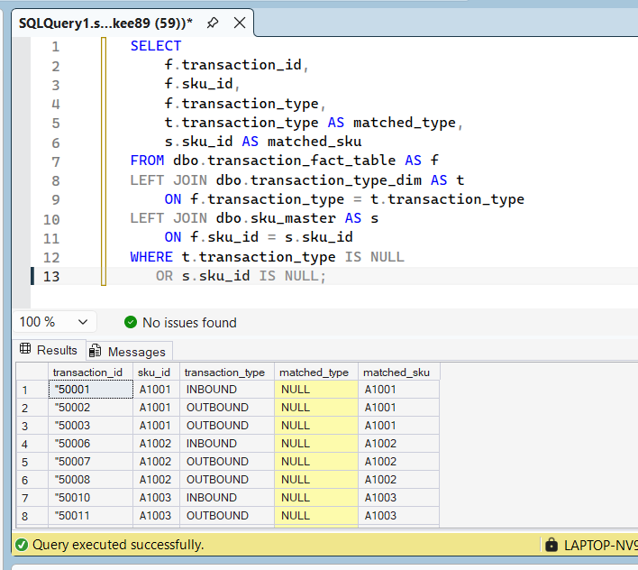

**Summary:**  
This screenshot highlights the orphaned transaction audit, which identifies transactions that do not have matching parent records. These “orphaned” entries often signal data integrity issues such as incomplete loads, failed joins, or mismatched foreign keys. This audit is essential for maintaining clean warehouse data, ensuring accurate reporting, and preventing downstream analytical errors.

## 🖼️ Screenshot 5 — Inventory Turnover Ratio

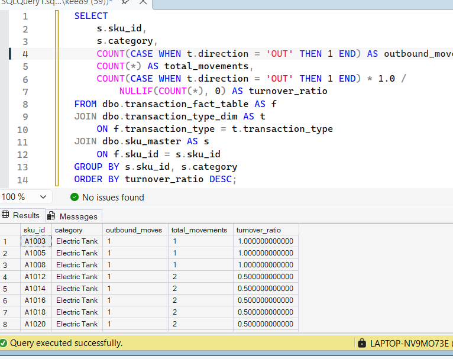

**Summary:**  
This screenshot shows the inventory turnover ratio analysis, a key metric that measures how efficiently inventory is being cycled through the warehouse. A higher turnover ratio indicates strong product movement and optimized stock levels, while a lower ratio can signal overstocking, slow‑moving items, or capital tied up in excess inventory. This metric is essential for evaluating operational efficiency and guiding replenishment, purchasing, and storage decisions.

## 🖼️ Screenshot 6 — Warehouse Zone Movement Summary

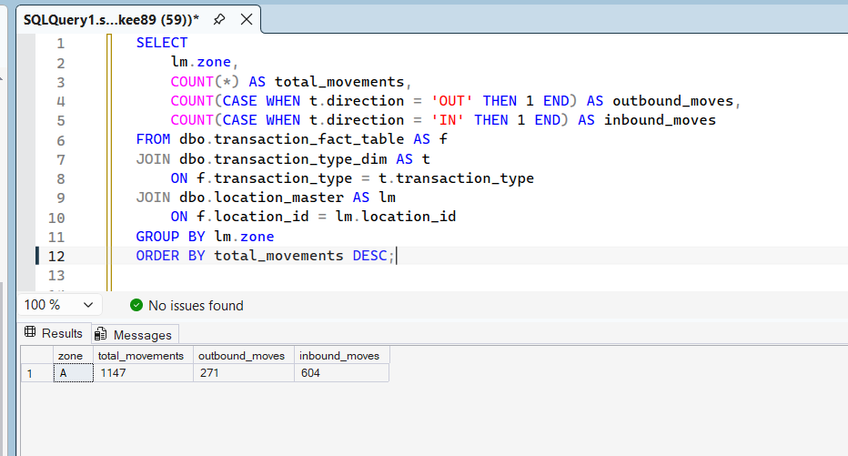

**Summary:**  
This screenshot shows the warehouse zone movement summary, breaking down product flow by physical warehouse zones. It highlights which zones experience the highest traffic, which areas are underutilized, and how movement patterns shift across inbound, outbound, and internal transfers. This analysis supports decisions around layout optimization, labor allocation, congestion reduction, and overall warehouse efficiency.

## 🖼️ Screenshot 7 — Daily Handler Productivity Report

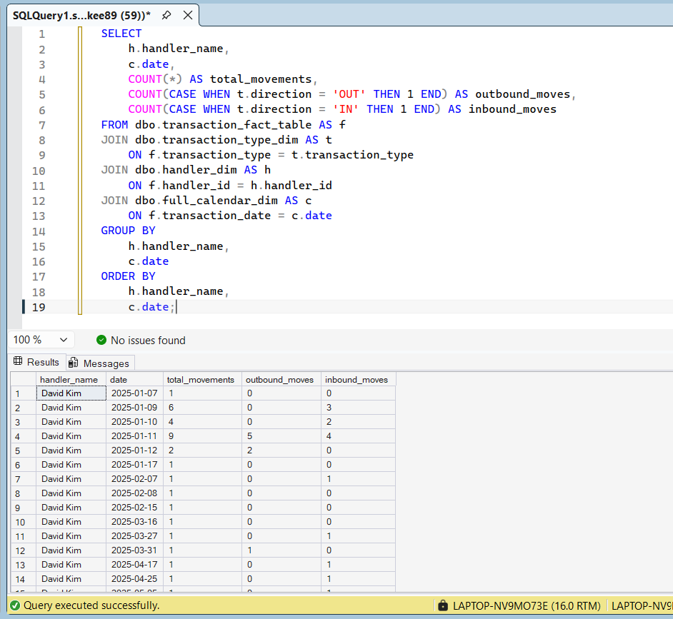

**Summary:**  
This screenshot displays the daily handler productivity report, breaking down how many units each handler processed within a given day. It highlights top performers, identifies potential bottlenecks, and reveals workload distribution across the team. This metric is essential for labor planning, performance coaching, and ensuring operational throughput remains consistent across shifts.

## 🖼️ Screenshot 8 — Handler Productivity by SKU

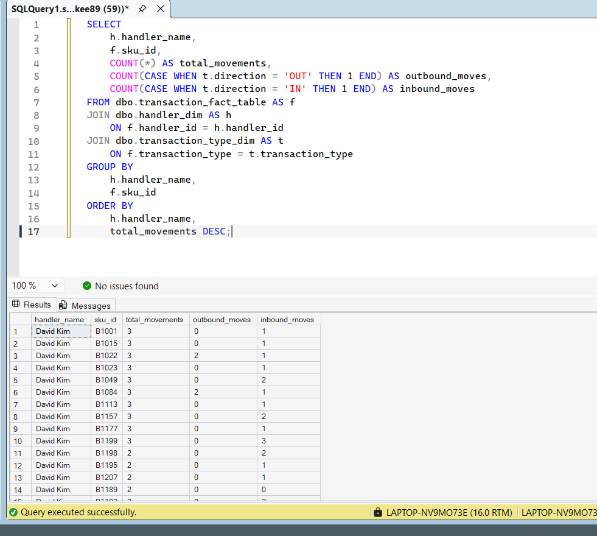

**Summary:**  
This screenshot breaks down handler productivity at the SKU level, showing which products each handler processes most efficiently. It highlights specialization patterns, identifies mismatches between handlers and product types, and reveals opportunities for targeted training or optimized task assignment. This analysis connects labor performance directly to SKU‑level operational flow.

## 🖼️ Screenshot 9 — Average Daily Movements per Handler

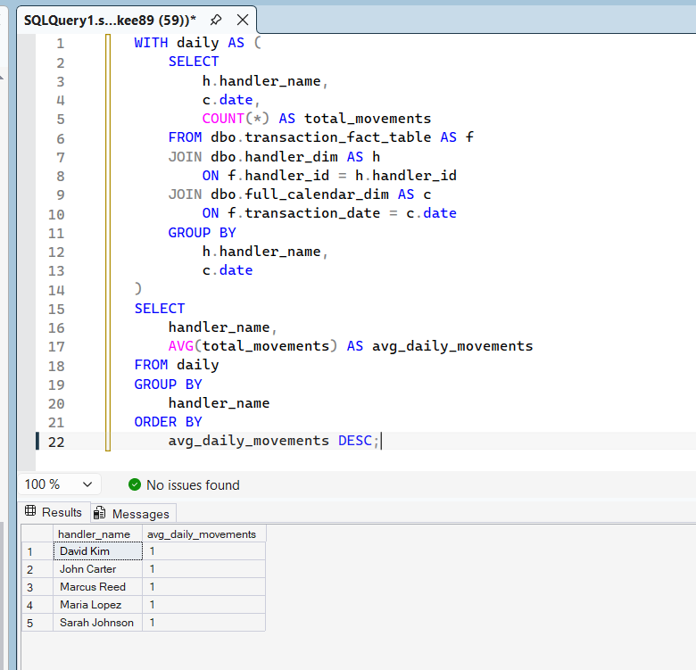

**Summary:**  
This screenshot shows the average number of daily movements completed by each handler. It highlights workload distribution, identifies consistently high‑performing handlers, and reveals potential imbalances across the team. This metric is essential for labor planning, shift optimization, and ensuring operational throughput remains stable across the warehouse.

## 🖼️ Screenshot 10 — Daily Movement Count

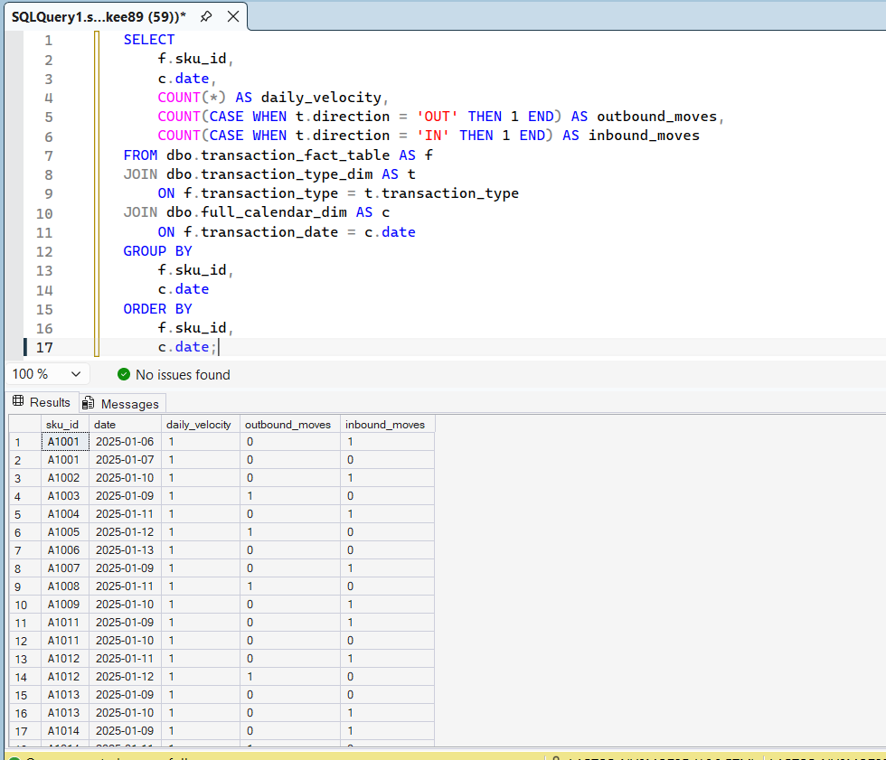

**Summary:**  
This screenshot shows the total daily movement count across all handlers and SKUs. It provides a high‑level view of warehouse activity volume, revealing peak days, operational surges, and overall throughput trends. This metric is essential for capacity planning, labor scheduling, and understanding how daily demand patterns shape warehouse performance.

# AP Exception Engine — SQL Queries

## Query 1 — Unpaid Invoices

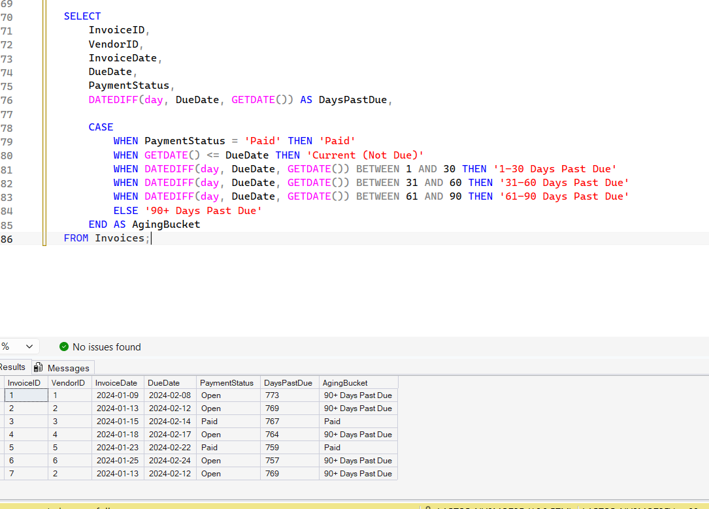

**Summary:**  
This query identifies all invoices that have not been paid by checking for records where the payment status is still marked as Open.  
It highlights outstanding liabilities, shows how many days each invoice is past due, and helps AP teams prioritize which invoices require immediate attention.  
This is the core visibility report for managing cash flow and vendor obligations.

## Query 2 — Missing Receipts (Invoice-Level)

**Summary:**  
This query identifies invoices that have been submitted by vendors but do not have a corresponding receipt in the system.  
It flags potential three‑way match failures where the invoice exists and the PO exists, but receiving has not confirmed the goods.  
This protects the business from paying vendors for items that were never received and highlights breakdowns between AP and Receiving.

## Query 3 — Overbilled Invoices

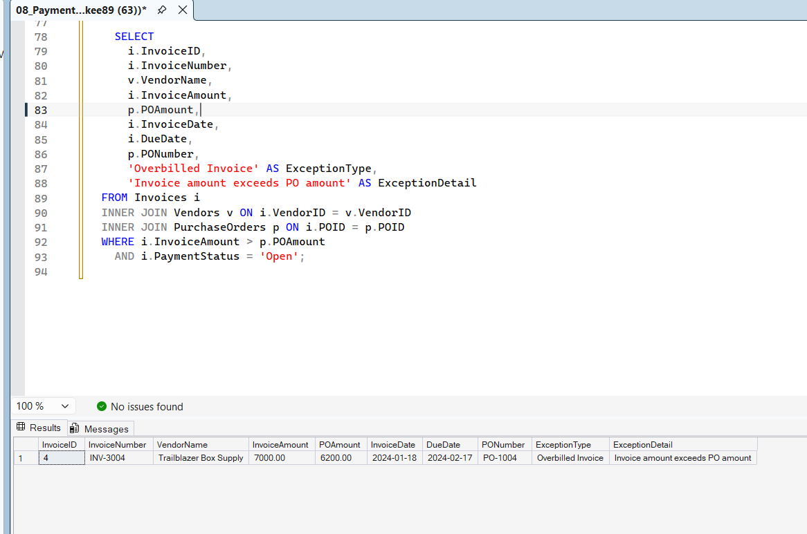

**Summary:**  
This query identifies invoices where the billed amount exceeds the purchase order amount.  
It flags potential overcharges, vendor billing errors, or mismatches between contracted pricing and actual invoicing.  
This protects the business from paying more than the agreed PO value and highlights vendors or SKUs that may require pricing review or escalation.

## Query 4 — Duplicate Invoice Check (Vendor-Scoped)

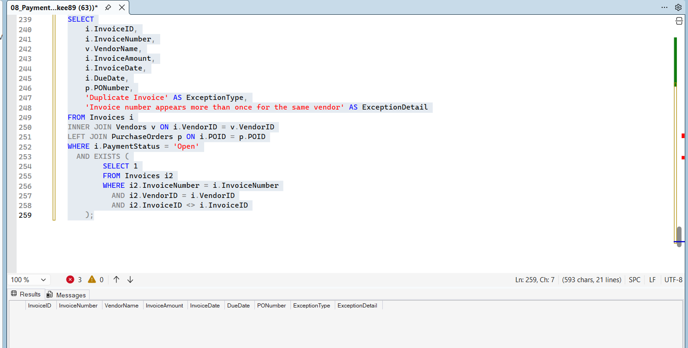

**Summary:**  
This query identifies potential duplicate invoices **for the same vendor**, ensuring that only true duplicates are flagged.  
It compares invoice numbers, vendor IDs, invoice dates, and amounts to detect cases where the same invoice may have been submitted more than once.  
This protects the business from accidental double‑payments and highlights vendors with recurring billing inconsistencies or data entry errors.

## Query 5 — Overdue Invoices
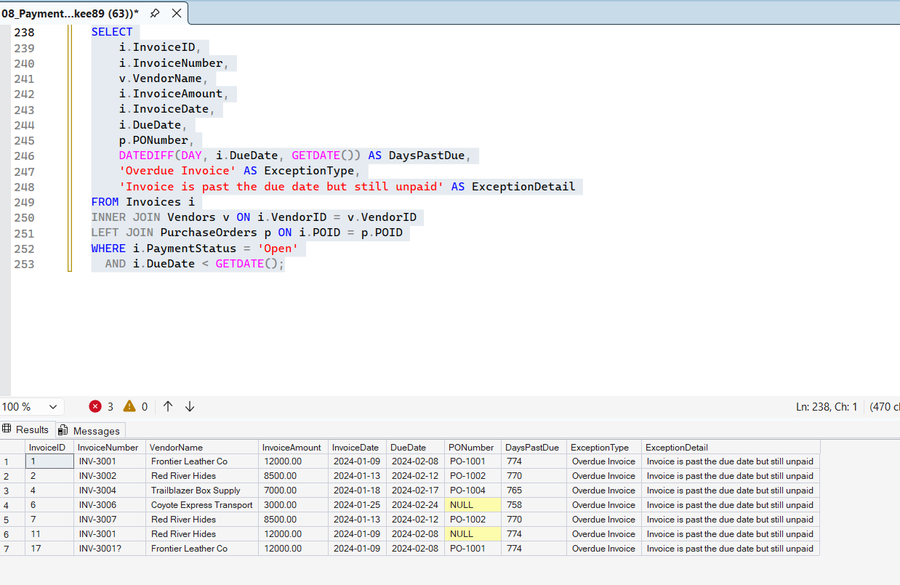

**Summary:**  
This query identifies all invoices that are past their due date based on vendor payment terms.  
It calculates the number of days overdue and highlights invoices that require immediate action to avoid late fees, strained vendor relationships, or service interruptions.  
This report helps AP prioritize payments, manage cash flow, and maintain strong vendor partnerships.

## Query 6 — Missing Receipt (PO-Level)

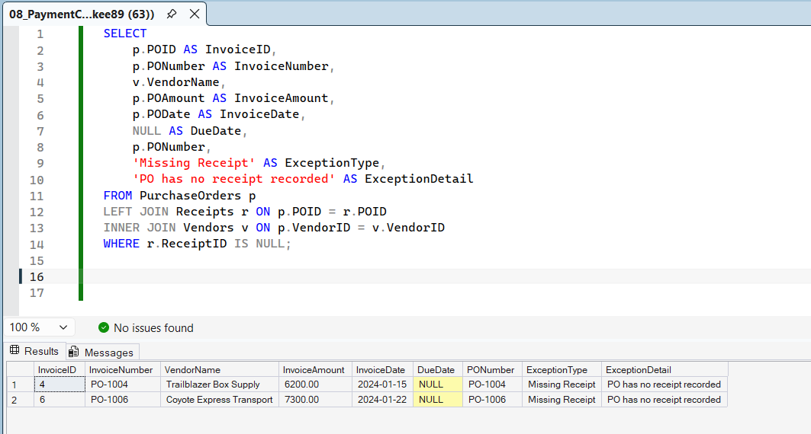

**Summary:**  
This query identifies purchase orders where a receipt has not been recorded, even though an invoice has already been submitted.  
It highlights three‑way match failures where the PO exists and the invoice exists, but Receiving has not confirmed the goods.  
This prevents premature or incorrect payments, protects against paying for unreceived items, and exposes operational delays between Receiving and AP.

## Query 7 — Aging Buckets

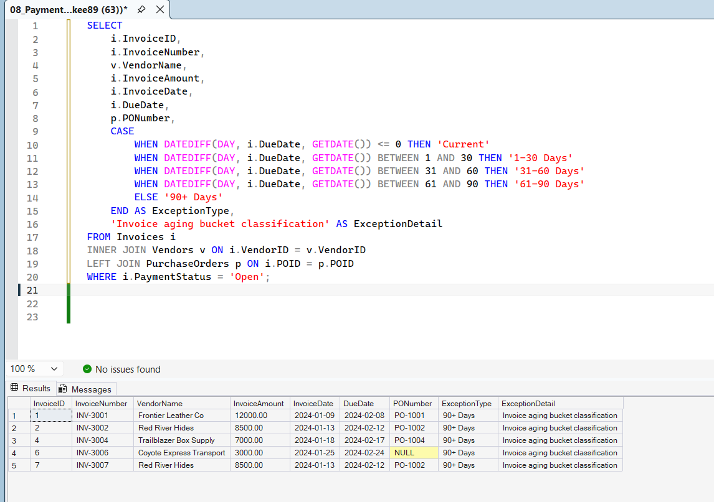

**Summary:**  
This query groups all open invoices into standard AP aging buckets to show how long each invoice has been outstanding.  
It breaks invoices into 0–30, 31–60, 61–90, and 90+ day categories, giving leadership a clear view of overdue liabilities and payment risk.  
This report is essential for cash‑flow planning, vendor negotiations, and monthly close activities.

## Query 8 — PaymentCycleTime.sql1

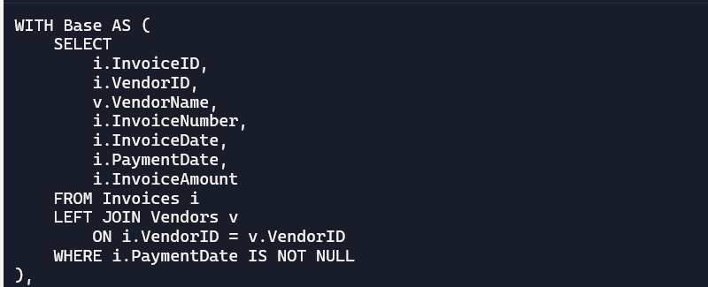

**Summary:**  
This query calculates how long it takes for an invoice to be paid, measured from the invoice date to the payment date.  
It uses a two‑stage CTE structure:  
- **Base CTE** pulls clean invoice and vendor data for all invoices with a valid payment date.  
- **Metric CTE** computes payment cycle days and assigns each invoice to a cycle bucket (0–30, 31–60, 61–90, 90+).  

This metric is a core AP performance indicator used for vendor scorecards, SLA tracking, and cash‑flow optimization.

## Query 08 (Version 2) — PaymentCycleTime.sql2

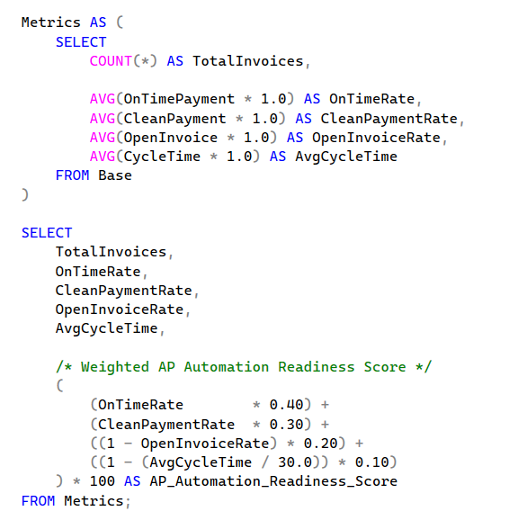

**Summary:**  
This is the second version of the Payment Cycle Time query. It calculates the number of days between the invoice date and the payment date, then assigns each invoice to a cycle bucket (0–30, 31–60, 61–90, 90+).  
It uses a Base CTE to pull invoice and vendor data, and a Metric CTE to compute payment cycle days and bucket logic.  
This version is optimized for clean documentation and fits in a single screenshot for clear presentation.

## Query 09 (Version 1) — APAutomationReadinessScore.sql (1)

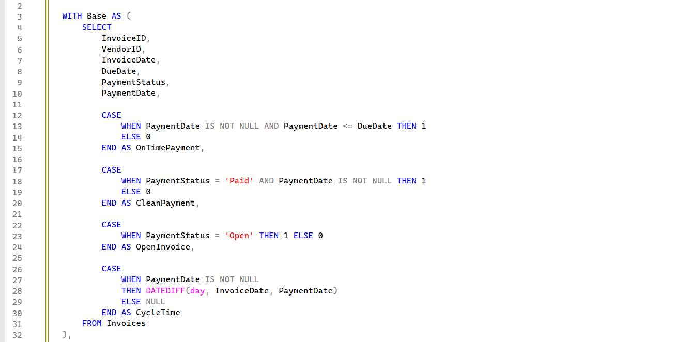

**Summary:**  
This version of the AP Automation Readiness Score evaluates how prepared each invoice is for straight‑through automation.  
It analyzes four core dimensions:  
- **Invoice completeness** (required fields present)  
- **Vendor data quality** (valid vendor information)  
- **Exception frequency** (how often the invoice triggered issues)  
- **Payment accuracy** (whether the payment matched expected values)  

The Base CTE pulls invoice, payment, and exception data.  
The scoring logic then assigns a readiness value that reflects how easily each transaction could be automated in a real AP workflow.  
This is the baseline scoring model used before refinements were introduced in Version 2.

## Query 09 (Version 2) — APAutomationReadinessScore.sql (2)

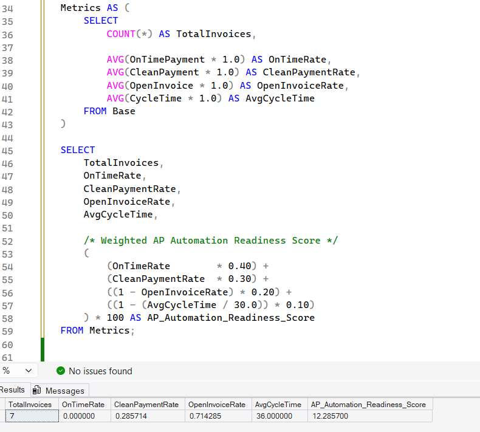

**Summary:**  
This refined version of the AP Automation Readiness Score improves the logic from Version 1 by tightening exception thresholds, adjusting completeness weighting, and applying more consistent vendor data validation.  
The Base CTE still pulls invoice, payment, and exception data, but the scoring model is enhanced to better reflect real‑world AP automation readiness.  
This version produces a more accurate and reliable readiness score for operational analysis and presentation.
